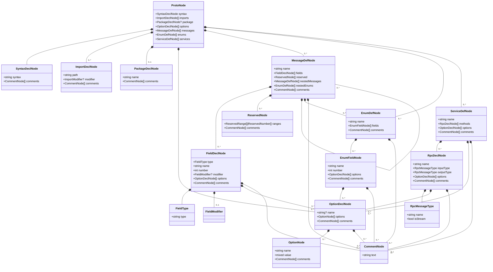

# PHP Protocol Buffer Parser

A powerful and flexible Protocol Buffers parser for PHP, capable of generating an Abstract Syntax Tree (AST) from
`.proto` files. This package provides a robust foundation for working with Protocol Buffers in PHP projects.

## Key Features

- Full support for Protocol Buffer syntax (proto3)
- Parses messages, enums, services, and RPC definitions
- Handles imports, packages, and options
- Preserves comments for documentation purposes
- Generates an Abstract Syntax Tree (AST) for easy manipulation
- Built with PHP 8.3

## Use Cases

- Generating code from protobuf definitions
- Analyzing and validating protobuf schemas
- Building tools for working with protocol buffers
- Integrating protobuf support into existing PHP applications

## Installation

Install the package via Composer:

```bash
composer require butschster/proto-parser
```

## Usage

Here's a quick example of how to use the Proto Parser:

```php
use Butschster\ProtoParser\ProtoParserFactory;

$parser = ProtoParserFactory::create();

$ast = $parser->parse(<<<'PROTO'
syntax = "proto3";

package example;

message Person {
  string name = 1;
  int32 id = 2;
  string email = 3;
}
PROTO);

// Now you can work with the AST
echo $ast->package->name; // Outputs: example
echo $ast->topLevelDefs[0]->name; // Outputs: Person
```

## Understanding AST (Abstract Syntax Tree)

An Abstract Syntax Tree (AST) is a tree representation of the abstract syntactic structure of source code. In the
context of this package, the AST represents the structure of a Protocol Buffer definition file.

Here's an example of what an AST looks like for a simple `.proto` file:

```protobuf
syntax = "proto3";

package example;

message Person {
    string name = 1;
    int32 id = 2;
    string email = 3;
}
```

The corresponding AST would look something like this:

```
ProtoNode
├── SyntaxDeclNode (syntax: "proto3")
├── PackageDeclNode (name: "example")
└── MessageDefNode (name: "Person")
    ├── FieldDeclNode (name: "name", type: "string", number: 1)
    ├── FieldDeclNode (name: "id", type: "int32", number: 2)
    └── FieldDeclNode (name: "email", type: "string", number: 3)
```

Each node in the AST corresponds to a specific element in the Protocol Buffer definition. This structure allows for easy
traversal and manipulation of the Protocol Buffer structure programmatically.

## AST Class Diagram

The following class diagram provides an overview of the AST node classes available in the Protobuf parser. This diagram
shows the relationships between different node classes and their properties.



## Detailed Usage Examples

### Parsing Messages

```php
$ast = $parser->parse(<<<'PROTO'
syntax = "proto3";

message Person {
  string name = 1;
  int32 id = 2;
  string email = 3;

  enum PhoneType {
    MOBILE = 0;
    HOME = 1;
    WORK = 2;
  }

  message PhoneNumber {
    string number = 1;
    PhoneType type = 2;
  }

  repeated PhoneNumber phones = 4;
}
PROTO);

$personMessage = $ast->topLevelDefs[0];
echo $personMessage->name; // Outputs: Person

foreach ($personMessage->fields as $field) {
    echo "{$field->name}: {$field->type->type}\n";
}

$phoneTypeEnum = $personMessage->enums[0];
echo $phoneTypeEnum->name; // Outputs: PhoneType

$phoneNumberMessage = $personMessage->messages[0];
echo $phoneNumberMessage->name; // Outputs: PhoneNumber
```

### Parsing Services

```php
$ast = $parser->parse(<<<'PROTO'
syntax = "proto3";

service Greeter {
  rpc SayHello (HelloRequest) returns (HelloReply) {}
  rpc SayHelloAgain (HelloRequest) returns (HelloReply) {}
}

message HelloRequest {
  string name = 1;
}

message HelloReply {
  string message = 1;
}
PROTO);

$service = $ast->topLevelDefs[0];
echo $service->name; // Outputs: Greeter

foreach ($service->methods as $method) {
    echo "{$method->name}: {$method->inputType->name} -> {$method->outputType->name}\n";
}
```

### Handling Imports and Options

```php
$ast = $parser->parse(<<<'PROTO'
syntax = "proto3";

import "google/protobuf/timestamp.proto";
import public "other.proto";

package mypackage;

option java_package = "com.example.foo";
option optimize_for = SPEED;

message MyMessage {
  string my_string = 1;
  google.protobuf.Timestamp time = 2;
}
PROTO);

foreach ($ast->imports as $import) {
    echo "Import: {$import->path} (Modifier: {$import->modifier})\n";
}

echo "Package: {$ast->package->name}\n";

foreach ($ast->options as $option) {
    echo "Option: {$option->name} = {$option->options[0]->value}\n";
}
```

## Example: Generating DTO Classes

One powerful use case for the AST is generating Data Transfer Object (DTO) classes from Protocol Buffer definitions. You
can use a code generator (like `nette/php-generator`) to create PHP classes based on the AST.

Here's an example of how you might use the AST to generate a PHP class:

```php
use Butschster\ProtoParser\ProtoParser;
use Butschster\ProtoParser\ProtoParserFactory;
use Nette\PhpGenerator\ClassType;
use Nette\PhpGenerator\PhpFile;

$parser = ProtoParserFactory::create();
$ast = $parser->parse(<<<'PROTO'
syntax = "proto3";

message Person {
  string name = 1;
  int32 age = 2;
  repeated string hobbies = 3;
}
PROTO,
);

// Generate PHP class
$file = new PhpFile();
$file->setStrictTypes();

$namespace = $file->addNamespace('App\Dto');

$class = $namespace->addClass('Person');
$class->setFinal()
    ->setReadOnly();

foreach ($ast->topLevelDefs[0]->fields as $field) {
    $type = match ($field->type->type) {
        'string' => 'string',
        'int32' => 'int',
        default => 'mixed',
    };
    
    $property = $class->addProperty($field->name)
        ->setType($type)
        ->setPublic();
    
    if ($field->modifier === \Butschster\ProtoParser\Ast\FieldModifier::Repeated) {
        $property->setType('array');
    }
}

echo $file;
```

This would generate a PHP class like this:

```php
<?php

declare(strict_types=1);

namespace App\Dto;

final readonly class Person
{
    public string $name;
    public int $age;
    public array $hobbies;
}
```

There are many possibilities for code generation using the AST. More use cases:

1. **Generate DTOs with Validation Attributes**: You can use the AST to generate DTOs with
   built-in validation using Symfony Validator attributes.

2. **Generate OpenAPI Schema**: By parsing the service RPC options, you can automatically generate OpenAPI (Swagger)
   schema documentation for your API endpoints, keeping your API documentation in sync with
   your protobuf definitions.

3. **Generate Clean JSON-Serializable DTOs**: Create DTOs that are optimized for JSON serialization, ensuring efficient
   data transfer between your PHP application and other systems or frontends.

4. **Static Analysis Tool Integration**: Use the AST to create custom PHPStan or Psalm rules that can analyze your
   protobuf usage within your PHP codebase, enhancing type safety and catching potential issues early.

5. **Code Migration Assistance**: Leverage the AST to help automate code migrations when your protobuf definitions
   change, ensuring that your PHP code stays in sync with evolving protobuf schemas.

## AST Node Classes

This document provides an overview of the available node classes in the Protobuf parser. These classes represent
different elements of a Protobuf definition file.

### ProtoNode

Represents the root node of a Protobuf file.

```php
final readonly class ProtoNode implements NodeInterface
{
    public function __construct(
        public SyntaxDeclNode $syntax,
        public array $imports = [],
        public ?PackageDeclNode $package = null,
        public array $options = [],
        public array $topLevelDefs = [],
    ) {}
}
```

- `$syntax`: The syntax declaration of the Protobuf file.
- `$imports`: An array of `ImportDeclNode` objects representing imported files.
- `$package`: An optional `PackageDeclNode` representing the package declaration.
- `$options`: An array of `OptionDeclNode` objects representing file-level options.
- `$topLevelDefs`: An array of top-level definitions (messages, enums, services).

### SyntaxDeclNode

Represents the syntax declaration of a Protobuf file.

```php
final readonly class SyntaxDeclNode implements NodeInterface
{
    public function __construct(
        public string $syntax,
        public array $comments = [],
    ) {}
}
```

- `$syntax`: The syntax version (e.g., "proto3").
- `$comments`: An array of `CommentNode` objects associated with the syntax declaration.

### ImportDeclNode

Represents an import statement in a Protobuf file.

```php
final readonly class ImportDeclNode implements NodeInterface
{
    public function __construct(
        public string $path,
        public ?ImportModifier $modifier = null,
        public array $comments = [],
    ) {}
}
```

- `$path`: The path of the imported file.
- `$modifier`: An optional `ImportModifier` enum value (Weak or Public).
- `$comments`: An array of `CommentNode` objects associated with the import statement.

### PackageDeclNode

Represents a package declaration in a Protobuf file.

```php
final readonly class PackageDeclNode implements NodeInterface
{
    public function __construct(
        public string $name,
        public array $comments = [],
    ) {}
}
```

- `$name`: The name of the package.
- `$comments`: An array of `CommentNode` objects associated with the package declaration.

### OptionDeclNode

Represents an option declaration in a Protobuf file.

```php
final readonly class OptionDeclNode implements NodeInterface
{
    public function __construct(
        public ?string $name,
        public array $comments = [],
        public array $options = [],
    ) {}
}
```

- `$name`: The name of the option.
- `$comments`: An array of `CommentNode` objects associated with the option.
- `$options`: An array of `OptionNode` objects representing nested options.

### MessageDefNode

Represents a message definition in a Protobuf file.

```php
final readonly class MessageDefNode implements NodeInterface
{
    public function __construct(
        public string $name,
        public array $fields = [],
        public array $messages = [],
        public array $enums = [],
        public array $comments = [],
    ) {}
}
```

- `$name`: The name of the message.
- `$fields`: An array of `FieldDeclNode` objects representing the message fields.
- `$messages`: An array of nested `MessageDefNode` objects.
- `$enums`: An array of `EnumDefNode` objects defined within the message.
- `$comments`: An array of `CommentNode` objects associated with the message.

### FieldDeclNode

Represents a field declaration within a message.

```php
final readonly class FieldDeclNode implements NodeInterface
{
    public function __construct(
        public FieldType $type,
        public string $name,
        public int $number,
        public ?FieldModifier $modifier = null,
        public array $options = [],
        public array $comments = [],
    ) {}
}
```

- `$type`: A `FieldType` object representing the type of the field.
- `$name`: The name of the field.
- `$number`: The field number.
- `$modifier`: An optional `FieldModifier` enum value (Required, Optional, or Repeated).
- `$options`: An array of `OptionDeclNode` objects representing field options.
- `$comments`: An array of `CommentNode` objects associated with the field.

### EnumDefNode

Represents an enum definition in a Protobuf file.

```php
final readonly class EnumDefNode implements NodeInterface
{
    public function __construct(
        public string $name,
        public array $fields = [],
        public array $comments = [],
    ) {}
}
```

- `$name`: The name of the enum.
- `$fields`: An array of `EnumFieldNode` objects representing the enum values.
- `$comments`: An array of `CommentNode` objects associated with the enum.

### EnumFieldNode

Represents a field within an enum definition.

```php
final readonly class EnumFieldNode implements NodeInterface
{
    public function __construct(
        public string $name,
        public int $number,
        public array $options = [],
        public array $comments = [],
    ) {}
}
```

- `$name`: The name of the enum value.
- `$number`: The numeric value associated with the enum field.
- `$options`: An array of `OptionDeclNode` objects representing field options.
- `$comments`: An array of `CommentNode` objects associated with the enum field.

### ServiceDefNode

Represents a service definition in a Protobuf file.

```php
final readonly class ServiceDefNode implements NodeInterface
{
    public function __construct(
        public string $name,
        public array $methods = [],
        public array $options = [],
        public array $comments = [],
    ) {}
}
```

- `$name`: The name of the service.
- `$methods`: An array of `RpcDeclNode` objects representing the service methods.
- `$options`: An array of `OptionDeclNode` objects representing service options.
- `$comments`: An array of `CommentNode` objects associated with the service.

### RpcDeclNode

Represents an RPC (Remote Procedure Call) declaration within a service.

```php
final readonly class RpcDeclNode implements NodeInterface
{
    public function __construct(
        public string $name,
        public RpcMessageType $inputType,
        public RpcMessageType $outputType,
        public array $options = [],
        public array $comments = [],
    ) {}
}
```

- `$name`: The name of the RPC method.
- `$inputType`: An `RpcMessageType` object representing the input message type.
- `$outputType`: An `RpcMessageType` object representing the output message type.
- `$options`: An array of `OptionDeclNode` objects representing RPC options.
- `$comments`: An array of `CommentNode` objects associated with the RPC.

### MapFieldDeclNode

Represents a map field declaration within a message.

```php
final readonly class MapFieldDeclNode implements NodeInterface
{
    public function __construct(
        public FieldType $keyType,
        public FieldType $valueType,
        public string $name,
        public int $number,
        public array $options = [],
        public array $comments = [],
    ) {}
}
```

- `$keyType`: A `FieldType` object representing the key type of the map.
- `$valueType`: A `FieldType` object representing the value type of the map.
- `$name`: The name of the map field.
- `$number`: The field number.
- `$options`: An array of `OptionDeclNode` objects representing field options.
- `$comments`: An array of `CommentNode` objects associated with the map field.

### OneofFieldNode

Represents a field within a oneof group.

```php
final readonly class OneofFieldNode implements NodeInterface
{
    public function __construct(
        public FieldType $type,
        public string $name,
        public int $number,
        public array $options = [],
    ) {}
}
```

- `$type`: A `FieldType` object representing the type of the field.
- `$name`: The name of the field.
- `$number`: The field number.
- `$options`: An array of `OptionDeclNode` objects representing field options.

### CommentNode

Represents a comment in the Protobuf file.

```php
final readonly class CommentNode
{
    public function __construct(
        public string $text,
    ) {}
}
```

- `$text`: The text content of the comment.

### ReservedNode

Represents a reserved statement in a message or enum.

```php
final readonly class ReservedNode implements NodeInterface
{
    public function __construct(
        public array $ranges,
    ) {}
}
```

- `$ranges`: An array of `ReservedRange` or `ReservedNumber` objects representing the reserved fields or numbers.

### OptionNode

Represents an individual option within an option declaration.

```php
final readonly class OptionNode
{
    public function __construct(
        public string $name,
        public mixed $value,
        public array $comments = [],
    ) {}
}
```

- `$name`: The name of the option.
- `$value`: The value of the option (can be a mixed type or another `OptionDeclNode`).
- `$comments`: An array of `CommentNode` objects associated with the option.

## Contributing

Contributions are welcome! Please follow these guidelines when contributing to the project:

1. Fork the repository and create your branch from `master`.
2. Ensure that your code follows the PSR-12 coding standard.
3. If you're modifying the parser grammar:
    - Edit the `ebnf.pp2` file to make your changes.
    - Run the unit tests to regenerate the `src/grammar.php` file.
    - Ensure that all existing tests pass and add new tests to cover your changes.
4. Update the documentation in the README if you're adding or changing functionality.
5. Write clear and concise commit messages.
6. Submit a pull request with a detailed description of your changes.

## License

This project is licensed under the MIT License.
